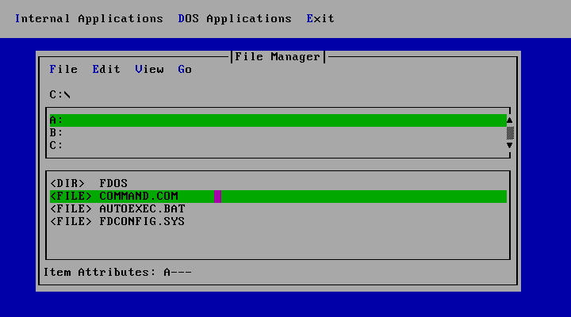

# FDTUI

Text User Interface Shell for FreeDOS

Copyright (C) 2017-2022 Ercan Ersoy

This program is licensed under GNU General Public License version 2 and GNU General Public License version 3.

This project includes FDOSTUI library. FDOSTUI has own licenses.

This project includes Kitten library. Kitten has own license.

# Thanks

* Thanks to Atnode for French translations.
* Thanks to Berki Yenigün for French translations.
* Thanks to Eric Auer for Kitten library.
* Thanks to FLTK Project for FDOSTUI Library.
* Thanks to Jerome Shidel for FDOSTUI Library.
* Thanks to Jim Hall for Kitten library.
* Thanks to Mark Olesen for some code changes and FDOSTUI library.
* Thanks to Parodper for Spanish translations.
* Thanks to Sebastian Rasmussen for Swedish translations.
* Thanks to Tom Ehlert for Kitten library.
* Thanks to Wilhelm Spiegl for German translations.

# Compile

This software should be compiled with Open Watcom.

# Contribute

If you want to contribute to this project, you can report possible bugs and
make a pull request to the FDTUI repository.

# Note

* FreeDOS is a trademark of Jim Hall.
