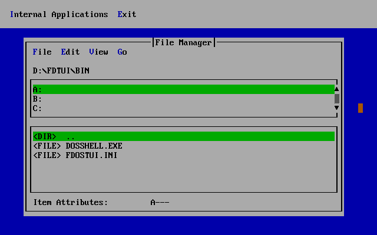

# FreeDOS TUI Shell

Text User Interface Shell for FreeDOS

Copyright (C) 2018 Ercan Ersoy 
This program is licensed under GNU General Public License version 3.

This project includes FDOSTUI library. FDOSTUI has own licenses. 
This project includes Kitten library. Kitten has own licenses.

# Thanks

Thanks to Atnode for French translation.

Thanks to Eric Auer for Kitten library.

Thanks to Jim Hall for Kitten library.

Thanks to Mark Olesen for some code changes and FDOSTUI library.

Thanks to Tom Ehlert for Kitten library.

# Compile

This software should be compiled with Open Watcom.

# Contribute

If you want to contribute to this project, you can make a pull request to the
FreeDOS TUI Shell repository.

# Changelog

**0.1 (07-13-2018):** Create first version.
